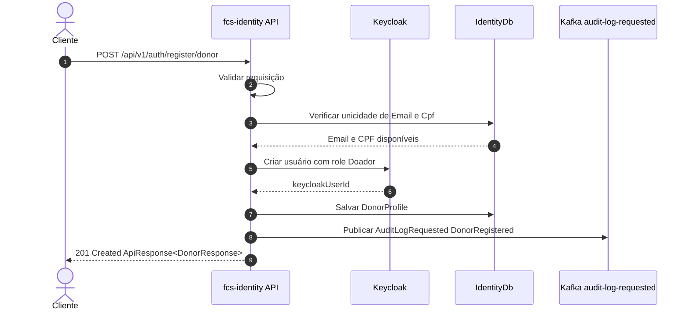
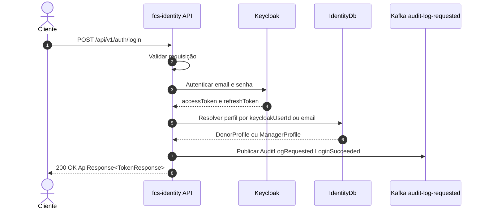
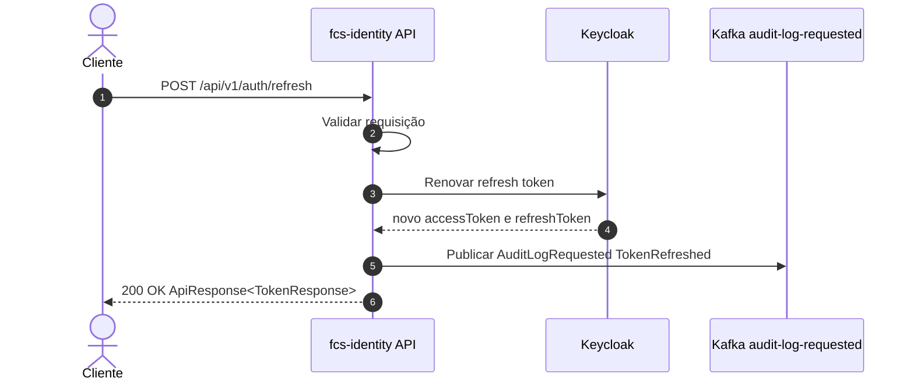
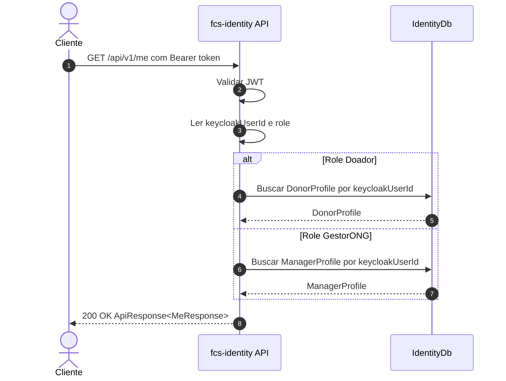

# fcs-identity

Serviço de **Identidade e Acesso** da plataforma **Conexão Solidária**. Atua como fachada do Keycloak e mantém os perfis de domínio (`DonorProfile` e `ManagerProfile`) associados aos usuários autenticáveis.

> Microsserviço que compõe o MVP da Conexão Solidária junto a `fcs-campaign`, `fcs-donations`, `fcs-donation-worker`, `fcs-audit-logs`, `fcs-bff` e `fcs-web`.

---

## Responsabilidades

- Cadastro público de **Doador** (`POST /api/v1/auth/register/donor`).
- Login e refresh de tokens delegados ao Keycloak (`POST /api/v1/auth/login`, `POST /api/v1/auth/refresh`).
- Consulta do perfil autenticado (`GET /api/v1/me`).
- Provisionamento administrativo (seed) de **GestorONG** no Keycloak e sincronização do `ManagerProfile` no `IdentityDb`.
- Emissão de **JWT** pelo Keycloak para uso em todos os serviços com **RBAC** nas roles `GestorONG` e `Doador`.
- Auditoria explícita de eventos relevantes via tópico Kafka `audit-log-requested`.

A aplicação **não** armazena senha nem hash de senha. As credenciais permanecem no Keycloak.

Documentação completa da arquitetura: [group10-tc-01/fcs-fase05-docs](https://github.com/group10-tc-01/fcs-fase05-docs).

Referências diretas:

- [Visão geral da arquitetura](https://github.com/group10-tc-01/fcs-fase05-docs/blob/main/architecture/overview.md)
- [Modelo da fcs-identity](https://github.com/group10-tc-01/fcs-fase05-docs/blob/main/architecture/fcs-identity-model.md)
- [Fluxos de endpoints](https://github.com/group10-tc-01/fcs-fase05-docs/blob/main/architecture/endpoint-flows.md)

ADRs relevantes:

- [ADR 0001 — Keycloak atrás da fcs-identity](https://github.com/group10-tc-01/fcs-fase05-docs/blob/main/adr/0001-keycloak-behind-identity-api.md)
- [ADR 0003 — Provisionamento de GestorONG no Keycloak](https://github.com/group10-tc-01/fcs-fase05-docs/blob/main/adr/0003-provision-gestorong-in-keycloak.md)
- [ADR 0004 — Registro de Doador via fcs-identity](https://github.com/group10-tc-01/fcs-fase05-docs/blob/main/adr/0004-register-doador-through-identity-api.md)
- [ADR 0011 — SQL Server para databases de serviço](https://github.com/group10-tc-01/fcs-fase05-docs/blob/main/adr/0011-use-sql-server-for-service-databases.md)

---

## Perfis e Roles

Roles canônicas do MVP:

| Role         | Cadastro                                          |
|--------------|---------------------------------------------------|
| `Doador`     | Público, via `POST /api/v1/auth/register/donor`   |
| `GestorONG`  | Seed administrativo na inicialização do serviço   |

---

## Estrutura do projeto

```
src/
  Fcs.Identity.Domain/                  # DonorProfile, ManagerProfile, value objects
  Fcs.Identity.Application/             # Casos de uso, CQRS, validação
  Fcs.Identity.Infrastructure.Keycloak/ # Integração com Admin API + token endpoint
  Fcs.Identity.Infrastructure.SqlServer/# EF Core + IdentityDb
  Fcs.Identity.Infrastructure.Kafka/    # Publicação de eventos quando aplicável
  Fcs.Identity.Resources/               # Contratos de mensagens e erros
  Fcs.Identity.WebApi/                  # Controllers v1, middlewares, DI, /health, /metrics
tests/
  Fcs.Identity.UnitTests/
  Fcs.Identity.IntegratedTests/
  Fcs.Identity.FunctionalTests/
  Fcs.Identity.ArchitectureTests/
  Fcs.Identity.CommomTestsUtilities/
```

Estrutura interna alinhada ao padrão da fase 04 ([ADR 0019](https://github.com/group10-tc-01/fcs-fase05-docs/blob/main/adr/0019-use-phase-04-dotnet-service-structure.md)).

---

## Endpoints

Base path: `/api/v1`.

| Método | Rota                              | Acesso        | Descrição                                          |
|--------|-----------------------------------|---------------|----------------------------------------------------|
| POST   | `/api/v1/auth/register/donor`     | Público       | Cadastra um **Doador** na aplicação e no Keycloak  |
| POST   | `/api/v1/auth/login`              | Público       | Login (delegado ao Keycloak)                       |
| POST   | `/api/v1/auth/refresh`            | Público       | Renova access/refresh tokens                       |
| GET    | `/api/v1/me`                      | Autenticado   | Retorna perfil do usuário autenticado              |
| GET    | `/health`                         | Operacional   | Healthcheck                          |
| GET    | `/metrics`                        | Operacional   | Métricas Prometheus/OpenTelemetry    |

Padrão de resposta `ApiResponse<T>` e cenários de falha documentados nos [fluxos de endpoints](https://github.com/group10-tc-01/fcs-fase05-docs/blob/main/architecture/endpoint-flows.md).

### Fluxos principais dos endpoints

#### POST /api/v1/auth/register/donor



#### POST /api/v1/auth/login



#### POST /api/v1/auth/refresh



#### GET /api/v1/me



### Exemplo: cadastrar Doador

```http
POST /api/v1/auth/register/donor
Content-Type: application/json

{
  "fullName": "Maria Silva",
  "email": "maria@email.com",
  "cpf": "12345678909",
  "password": "StrongPassword123!"
}
```

### Exemplo: login e obtenção do JWT

```http
POST /api/v1/auth/login
Content-Type: application/json

{
  "email": "maria@email.com",
  "password": "StrongPassword123!"
}
```

Resposta:

```json
{
  "success": true,
  "data": {
    "accessToken": "<jwt>",
    "refreshToken": "<refresh>",
    "expiresIn": 300,
    "tokenType": "Bearer"
  },
  "errorMessages": null
}
```

O `accessToken` deve ser enviado como `Authorization: Bearer <jwt>` nas demais APIs (`fcs-campaign`, `fcs-donations`).

---

## Pré-requisitos

- [.NET 10 SDK](https://dotnet.microsoft.com/download)
- [Docker](https://docs.docker.com/get-docker/) e Docker Compose
- Portas livres no host: `1433` (SQL Server), `8081` (Keycloak), `9092` (Kafka), `5341` (Seq), `8080` (API).

---

## Subindo o ambiente local

O `docker-compose.yml` deste repositório sobe **apenas** as dependências deste serviço (SQL Server, Keycloak, Kafka, Seq) e, opcionalmente, a própria API. Para o ambiente completo integrado da Conexão Solidária utilize o repositório `fcs-infra`.

### 1. Subir dependências

```bash
docker compose up -d sqlserver keycloak-db-init keycloak kafka zookeeper seq
```

O serviço `keycloak-db-init` cria o database `KeycloakDb` no SQL Server. O Keycloak inicia em `start-dev --import-realm` e importa o realm `conexao-solidaria` a partir de `./keycloak/conexao-solidaria-realm.json`.

URLs úteis:

- Keycloak Admin Console: http://localhost:8081 (`admin` / `admin`)
- Seq: http://localhost:5341
- SQL Server: `localhost,1433` (`sa` / `Your_password123`)

### 2. Rodar a API localmente

```bash
dotnet restore
dotnet build
dotnet run --project src/Fcs.Identity.WebApi
```

Por padrão a API sobe em `http://localhost:5000` (perfil `Development`). Acesse o Swagger em `http://localhost:5000/swagger`.

### 2b. Rodar a API também em container

```bash
docker compose up -d --build api
```

A API ficará exposta em `http://localhost:8080`.

### 3. Provisionamento do GestorONG (seed)

Na inicialização, a `fcs-identity` executa o seed que:

1. Cria/encontra o usuário **GestorONG** no Keycloak.
2. Garante a role `GestorONG` atribuída.
3. Cria/atualiza o `ManagerProfile` no `IdentityDb`.

Credenciais e dados do seed são configuráveis via `appsettings.{Environment}.json` ou variáveis de ambiente.

---

## Testes

```bash
# Todos os testes
dotnet test

# Por projeto
dotnet test tests/Fcs.Identity.UnitTests
dotnet test tests/Fcs.Identity.IntegratedTests
dotnet test tests/Fcs.Identity.FunctionalTests
dotnet test tests/Fcs.Identity.ArchitectureTests
```

Cobertura mínima exigida pela esteira: **80%** ([ADR 0021](https://github.com/group10-tc-01/fcs-fase05-docs/blob/main/adr/0021-test-strategy-for-apis-and-worker.md)).

---

## Observabilidade

- Logs estruturados com **Serilog** enviados ao **Seq** em ambiente local.
- **OpenTelemetry** para tracing e métricas.
- Endpoints operacionais:
  - `GET /health`
  - `GET /metrics`

Na VPS, a exposição pública passa pelo Traefik com TLS; endpoints `/internal/*` permanecem restritos a Services e DNS interno do Kubernetes, conforme a [visão geral da arquitetura](https://github.com/group10-tc-01/fcs-fase05-docs/blob/main/architecture/overview.md). Os endpoints `/health`, `/metrics` e `/swagger` também são disponibilizados pelo Ingress da aplicação para suporte operacional; o Datadog continua consumindo `/metrics` e `/health` por Autodiscovery dentro da rede do pod.

---

## CI/CD

A esteira está em `.github/workflows/` reutilizando os workflows reutilizáveis do repositório `fcs-pipelines` ([ADR 0018](https://github.com/group10-tc-01/fcs-fase05-docs/blob/main/adr/0018-reuse-fcs-pipelines-for-ci-cd.md)):

- `branch-name-check.yml` — política de nomes de branch
- `dotnet-service-ci.yml` — build .NET, testes, SonarCloud, Trivy, build da imagem Docker
- `dotnet-service-delivery.yml` — entrega da imagem imutável no K3s da VPS
  por runner GitHub hospedado, através de túnel SSH privado para a API K3s

Gates principais: secret scan (Gitleaks), dependency scan, restore/build, testes com cobertura mínima de 80%, SonarCloud, Docker build, Trivy, deploy condicional, healthcheck pós-rollout.

---

## Kubernetes

O `k8s/kustomization.yaml` aplica todos os recursos proprietários do serviço:
Deployment, ConfigMap, Service, RBAC, Ingress HTTPS, Certificate e o
`InfisicalStaticSecret` que gera `identity-runtime`. Os recursos compartilhados
(Traefik, cert-manager, Infisical Operator, Keycloak, Kafka e bancos) são
gerenciados pelo `fcs-infra`; valores de produção não são versionados neste
repositório ([ADR 0022](https://github.com/group10-tc-01/fcs-fase05-docs/blob/main/adr/0022-use-separated-kubernetes-namespaces.md)).

Namespace alvo: `fcs-identity`.
Ele é criado e mantido pelo `fcs-infra`; por isso o Kustomize da aplicação não
tenta recriá-lo.

Os caminhos públicos da VPS são:

- `https://fcs-identity.flaviojcf.com.br/api`
- `https://fcs-identity.flaviojcf.com.br/swagger`
- `https://fcs-identity.flaviojcf.com.br/health`
- `https://fcs-identity.flaviojcf.com.br/metrics`

### Secrets e variables do deploy

Configure os secrets no repositório GitHub. O environment `production` continua
sendo o gate de aprovação do deploy:

| Tipo | Nome | Uso |
|---|---|---|
| Secret | `K3S_KUBECONFIG` | Kubeconfig capaz de aplicar os recursos do namespace. No primeiro deploy, use o kubeconfig administrativo do K3s; depois, rotacione para uma credencial limitada ao namespace. |
| Secret | `VPS_DEPLOY_SSH_KEY` | Chave privada do usuário `fcs-vps-deployer` para abrir o túnel. |
| Secret | `VPS_KNOWN_HOSTS` | Host key da VPS obtida por canal confiável. |
| Variable | `VPS_HOST` | IP ou hostname da VPS. |
| Variable | `VPS_DEPLOY_USER` | `fcs-infra-deployer`. |

O Infisical deve conter os valores `sql-sa-password`,
`keycloak-admin-password` e `manager-password` no projeto `fcs-platform-dd-uk`,
ambiente `prod`, path `/platform`. O Operator instalado pelo `fcs-infra`
sincroniza esses valores para o Secret Kubernetes `identity-runtime`.

---

## Banco de dados

- Engine: **SQL Server** ([ADR 0011](https://github.com/group10-tc-01/fcs-fase05-docs/blob/main/adr/0011-use-sql-server-for-service-databases.md))
- ORM: **Entity Framework Core** ([ADR 0012](https://github.com/group10-tc-01/fcs-fase05-docs/blob/main/adr/0012-use-entity-framework-core.md))
- Database: `IdentityDb`
- Tabelas principais: `DonorProfiles`, `ManagerProfiles`

Para aplicar as migrations:

```bash
dotnet ef database update \
  --project src/Fcs.Identity.Infrastructure.SqlServer \
  --startup-project src/Fcs.Identity.WebApi
```

---

## Como este serviço atende ao hackathon

| Requisito do hackathon                                                | Onde é atendido                                              |
|-----------------------------------------------------------------------|--------------------------------------------------------------|
| Autenticação via JWT                                                  | Tokens emitidos pelo Keycloak via `fcs-identity`             |
| RBAC com perfis `GestorONG` e `Doador`                                | Roles canônicas mapeadas no Keycloak e validadas nas APIs    |
| Cadastro de Doador (público)                                          | `POST /api/v1/auth/register/donor`                           |
| Senha com hash seguro                                                 | Delegado ao Keycloak (a fcs-identity não guarda senha)       |
| Endpoint `/health` e `/metrics`                                       | Expostos pela WebApi                                         |
| Imagem Docker e pipeline                                              | `Dockerfile` + workflows em `.github/workflows`              |
| Microsserviço distinto                                                | `fcs-identity` separado de `fcs-campaign` e `fcs-donations` |

Os fluxos de **Campanha**, **Intenção de Doação**, **Doação** processada e **Painel de Transparência** são implementados pelos demais serviços da plataforma. Veja a [visão geral da arquitetura](https://github.com/group10-tc-01/fcs-fase05-docs/blob/main/architecture/overview.md).
